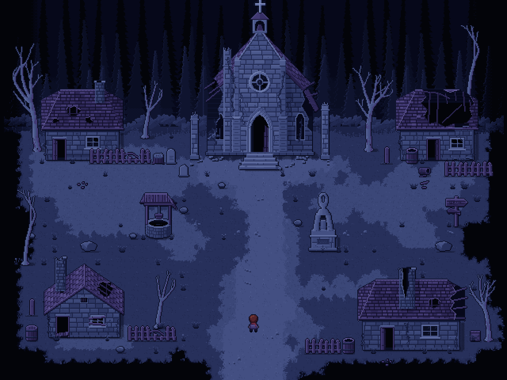

# Заброшенная деревня — пиксель-арт локация и тайлсет



Ночная деревня у кромки соснового леса: разрушенная часовня, четыре пустых дома,
колодец, безликая статуя, указатель и тропа, уходящая на юг в темноту.
Локация собрана **целиком из тайлсета** — рендер и `.tmx` совпадают попиксельно.

- Тайл: **16×16 px**
- Карта: **40×30 тайлов** (640×480 px)
- Палитра: **Moonlit Indigo**, 38 цветов (18 ночных, 10 фиолетовых для дерева и кровли, 10 акцентных для персонажа)
- Свет: луна сверху слева, все тени падают вправо-вниз

## Что где лежит

| Папка | Содержимое |
|---|---|
| `render/` | Готовая картинка локации: ×1, ×2, ×3, ×4 и версия без персонажа |
| `tileset/abandoned_village_tileset.png` | Тайлсет-атлас 512×944 (32×59 тайлов), без отступов между тайлами |
| `tileset/abandoned_village.tsx` | Тайлсет для Tiled с Wang-набором «Ground» (кисть террейна) |
| `tileset/…_preview.png` | Атлас ×3 с сеткой — удобно рассматривать |
| `maps/abandoned_village.tmx` | Карта для Tiled: слои, коллизии, точка старта |
| `maps/abandoned_village.json` | Та же карта в формате Tiled JSON (Phaser, Godot-импортёры и т. п.) |
| `maps/abandoned_village_objects.json` | Список объектов со спрайтами, координатами, линией Y-сортировки и коллизией |
| `sprites/` | Каждый объект отдельным PNG + персонаж `wanderer.png` |
| `palette/` | Палитра в `.gpl` (GIMP/Aseprite), `.hex` и `.png` |
| `preview/index.html` | Интерактивное превью: ходьба, коллизии, осмотр объектов, просмотр тайлсета |
| `src/` | Генератор на Python — всё выше пересобирается одной командой |

## Тайлсет

Сверху вниз:

1. **Террейн (8 рядов).** Угловой Wang-набор из четырёх поверхностей: пустота, трава, мох, тропа.
   Каждая пара (пустота/трава, трава/мох, трава/тропа, мох/тропа) — три блока 4×4, по одному на вариант.
   Блок бесшовен сам с собой, поэтому в атласе читается как картинка. Рядом блок 9×4 со всеми
   стыками «трава + мох + тропа» в одном тайле. Варианты нужны, чтобы край не повторялся.
2. **Декор.** 16 пучков травы (каждый в двух положениях внутри тайла), камешки, камни, валун, обломки досок и черепицы, упавшая колонна.
3. **Пропсы.** Забор (левый край, три середины, сломанный, правый край, отдельный столб), бочки (открытая, закрытая, опрокинутая), пень, ящик, три надгробия, обломок колонны, указатель, колодец, статуя.
4. **Деревья.** Шесть мёртвых деревьев: высокое, кривое, раскидистое, среднее, малое, тонкое.
5. **Здания.** Часовня 11×14 и четыре дома, каждый разрушен по-своему.
6. **Лес.** Фон 8×11 тайлов в двух вариантах. Варианты тайлятся по горизонтали в любом порядке. Отдельно левый и правый торцы, уходящие в темноту.

Полупрозрачные пиксели в атласе — мягкие контактные тени, они уже нарисованы под объектами.

## Слои карты

| Слой | Что в нём |
|---|---|
| `Ground` | Террейн |
| `Decor` | Трава, камешки, валуны |
| `Forest` | Лесной фон |
| `Objects 1…4` | Нижние части объектов (рисуются под персонажем). Слоёв несколько, потому что объекты перекрываются |
| `Overhead 1` | Верхушки объектов над их основанием (рисуются над персонажем) |
| `Collision` (объекты) | Прямоугольники: основания зданий и пропсов, пустота по краям, стена леса |
| `Markers` (объекты) | `PlayerStart`, выход на юг, дверь часовни |

## Как подключить

**Tiled.** Откройте `maps/abandoned_village.tmx`. Для рисования новых карт выберите Wang-набор «Ground»
во вкладке Terrain Sets: кисть сама подбирает переходы и варианты.

**Godot 4.** Создайте TileSet из `abandoned_village_tileset.png` (16×16, без отступов) или импортируйте `.tmx`
плагином YATI. Для правильного перекрытия с персонажем удобнее ставить объекты сценами из `sprites/`
по `abandoned_village_objects.json` и включить Y Sort. Поле `sort_y` — линия, где объект касается земли.

**GameMaker.** Tile Set из PNG: 16×16, отступы 0. Здания и деревья можно ставить как объекты-спрайты
из `sprites/` с `depth = -y` по линии `sort_y`.

**Unity.** Импорт `.tmx` через SuperTiled2Unity или нарезка атласа в Sprite Editor по сетке 16×16.

**Phaser.** `maps/abandoned_village.json` + `tileset/abandoned_village_tileset.png` грузятся штатным `load.tilemapTiledJSON`.

**RPG Maker MV/MZ** работает с тайлами 48 px. Атлас можно увеличить ровно в 3 раза (nearest neighbour), но раскладку авто-тайлов RPG Maker придётся собрать вручную.

> Слои `Objects`/`Overhead` — классический приём без Y-сортировки. Он не идеален для деревьев:
> если встать прямо перед стволом, верх дерева окажется над головой персонажа. Где есть Y-сортировка,
> используйте спрайты из `sprites/` — так сделано в превью.

## Персонаж

`sprites/wanderer.png` — оригинальный персонаж «Странник», кадр 16×24.
Лист 48×96: ряды — вниз, влево, вправо, вверх; столбцы — стойка, шаг A, шаг B.
Цикл ходьбы: стойка → A → стойка → B.

## Превью

Откройте `preview/index.html` в браузере: всё встроено в один файл, сервер не нужен.
Стрелки или WASD — идти, Shift — бежать, E или пробел — осмотреть колодец, статую, указатель, двери и надгробия.
Переключатели показывают сетку и коллизии, режим «Вся карта» показывает локацию целиком.

## Пересборка

```bash
pip install pillow numpy
python3 src/build.py
```

Генератор детерминированный: одинаковый код даёт одинаковые PNG. Композиция карты — в `src/layout.py`,
палитра — в `src/palette.py`, объекты — в `church.py`, `houses.py`, `props.py`, `trees.py`, `forest.py`.
