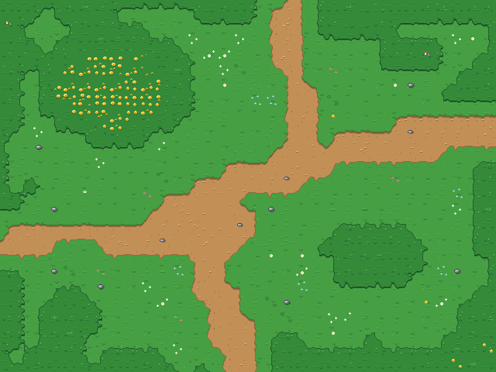
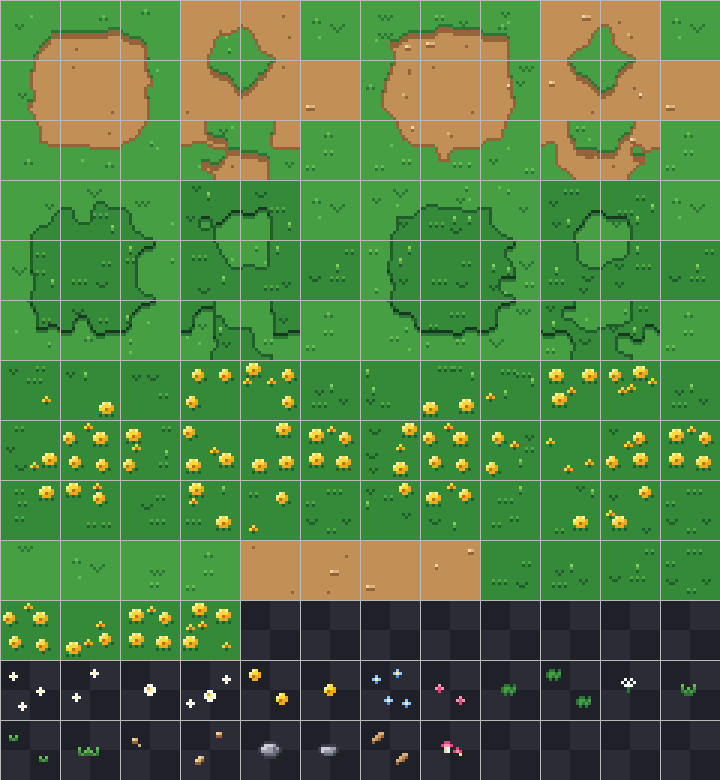

# Луг — поверхность в стиле Undertale

Только земля: трава, тропинка, густая трава и клумба золотых цветов, плюс плоский декор.
Рисовка как в Undertale: плоские цвета, 3–5 тонов на материал, одна тёмная линия по краю, никакого шума и градиентов.

- Тайл **20×20** (как в Undertale), атлас 240×260 (12×13 тайлов), без отступов
- Пример комнаты **32×24 тайла** = 640×480, ровно четыре экрана Undertale (320×240)

## Тайлсет

| Ряды | Что там |
|---|---|
| 1–3 | Тропинка среди травы: классический блок 3×3 + 4 внутренних угла + 2 диагонали, два варианта края |
| 4–6 | Пятно густой травы на обычной траве, так же |
| 7–9 | Клумба золотых цветов в густой траве, так же |
| 10–11 | Простые варианты: трава ×4, тропа ×4, густая трава ×4, цветы ×4 |
| 12–13 | Декор: ромашки, лютики, незабудки, розовые цветы, клевер, одуванчик, пучки травы, камешки, камень, камень-ступенька, листья, грибочки |

Внутри каждого блока 3×3 верхний левый тайл — внешний угол пятна, центр — само пятно,
тайлы справа — внутренние углы (если сложить их 2×2, получится маленький «островок» наоборот).

Поверхности вложены друг в друга: **тропа → трава → густая трава → цветы**. Рядом должны лежать
только соседние по этой цепочке: цветы окружены густой травой, густая трава — обычной, тропа — травой.

## Файлы

- `tileset/meadow_ground_tileset.png` — атлас; `…@3x.png` — он же с сеткой
- `tileset/meadow_ground.tsx` — для Tiled, с Wang-набором «Meadow»: кисть сама подбирает переходы
- `maps/meadow_ground_room.tmx` / `.json` — пример комнаты (слои `Ground` и `Details`)
- `render/` — комната ×1, ×2, ×3
- `palette/meadow.gpl`, `meadow.hex` — палитра (28 цветов)
- `src/` — генератор: `python3 src/build.py` (нужны `pillow`, `numpy`)

**GameMaker:** Tile Set из PNG, размер тайла 20×20, отступы 0. Декор — на отдельный слой тайлов поверх земли.
